# 📚 Documentación de API - Sistema de Registro de Tiempos

## 🌐 Información General

**URL Base:** `http://tu-servidor.com`  
**Protocolo WebSocket:** `ws://tu-servidor.com`  
**Formato:** JSON  
**Autenticación:** JWT (JSON Web Tokens)

---

## 📋 Índice de Contenidos

1. [Autenticación](#autenticación)
    - [Login](#1-login)
    - [Logout](#2-logout)
    - [Refresh Token](#3-refresh-token)
2. [WebSocket](#websocket)
    - [Conexión](#conexión-websocket)
    - [Registro Individual](#registro-individual-de-tiempo)
    - [Registro en Lote](#registro-en-lote-batch)
    - [Eventos del Servidor](#eventos-del-servidor)

---

# 🔐 AUTENTICACIÓN

## 1. Login

Autentica a un juez y obtiene los tokens de acceso.

### **Endpoint**

```
POST /api/login/
```

### **Headers**

```json
{
    "Content-Type": "application/json"
}
```

### **Body**

```json
{
    "username": "juez1",
    "password": "password123"
}
```

### **Respuesta Exitosa (200 OK)**

```json
{
    "access": "eyJhbGciOiJIUzI1NiIsInR5cCI6IkpXVCJ9...",
    "refresh": "eyJhbGciOiJIUzI1NiIsInR5cCI6IkpXVCJ9...",
    "juez": {
        "id": 1,
        "username": "juez1",
        "email": "juez1@ejemplo.com",
        "first_name": "Juan",
        "last_name": "Pérez",
        "competencia": {
            "id": 1,
            "nombre": "Carrera 5K",
            "fecha_hora": "2025-11-12T08:00:00",
            "en_curso": true,
            "activa": true
        },
        "activo": true,
        "telefono": "099123456"
    },
    "message": "Login exitoso"
}
```

### **Errores**

#### 400 Bad Request

```json
{
    "error": "Se requiere username y password."
}
```

#### 401 Unauthorized

```json
{
    "error": "Credenciales inválidas."
}
```

#### 403 Forbidden

```json
{
    "error": "Usuario inactivo. Contacte al administrador."
}
```

### **Ejemplo de Implementación**

#### JavaScript/TypeScript

```javascript
async function login(username, password) {
    const response = await fetch("http://tu-servidor.com/api/login/", {
        method: "POST",
        headers: {
            "Content-Type": "application/json",
        },
        body: JSON.stringify({ username, password }),
    });

    if (!response.ok) {
        const error = await response.json();
        throw new Error(error.error);
    }

    const data = await response.json();

    // Guardar tokens
    localStorage.setItem("access_token", data.access);
    localStorage.setItem("refresh_token", data.refresh);
    localStorage.setItem("juez_id", data.juez.id);

    return data;
}
```

#### Flutter/Dart

```dart
import 'dart:convert';
import 'package:http/http.dart' as http;

Future<Map<String, dynamic>> login(String username, String password) async {
  final response = await http.post(
    Uri.parse('http://tu-servidor.com/api/login/'),
    headers: {'Content-Type': 'application/json'},
    body: jsonEncode({
      'username': username,
      'password': password,
    }),
  );

  if (response.statusCode == 200) {
    final data = jsonDecode(response.body);

    // Guardar tokens (SharedPreferences)
    final prefs = await SharedPreferences.getInstance();
    await prefs.setString('access_token', data['access']);
    await prefs.setString('refresh_token', data['refresh']);
    await prefs.setInt('juez_id', data['juez']['id']);

    return data;
  } else {
    final error = jsonDecode(response.body);
    throw Exception(error['error']);
  }
}
```

#### Python

```python
import requests

def login(username, password):
    url = 'http://tu-servidor.com/api/login/'
    payload = {
        'username': username,
        'password': password
    }

    response = requests.post(url, json=payload)

    if response.status_code == 200:
        data = response.json()
        return data
    else:
        error = response.json()
        raise Exception(error.get('error'))
```

---

## 2. Logout

Cierra la sesión del juez e invalida el refresh token.

### **Endpoint**

```
POST /api/logout/
```

### **Headers**

```json
{
    "Content-Type": "application/json",
    "Authorization": "Bearer {access_token}"
}
```

### **Body**

```json
{
    "refresh": "eyJhbGciOiJIUzI1NiIsInR5cCI6IkpXVCJ9..."
}
```

### **Respuesta Exitosa (205 Reset Content)**

```json
{
    "message": "Sesión cerrada exitosamente."
}
```

### **Errores**

#### 400 Bad Request

```json
{
    "error": "Se requiere el refresh token."
}
```

```json
{
    "error": "Token inválido o ya fue utilizado."
}
```

#### 401 Unauthorized

```json
{
    "detail": "Authentication credentials were not provided."
}
```

### **Ejemplo de Implementación**

#### JavaScript/TypeScript

```javascript
async function logout() {
    const accessToken = localStorage.getItem("access_token");
    const refreshToken = localStorage.getItem("refresh_token");

    const response = await fetch("http://tu-servidor.com/api/logout/", {
        method: "POST",
        headers: {
            "Content-Type": "application/json",
            Authorization: `Bearer ${accessToken}`,
        },
        body: JSON.stringify({ refresh: refreshToken }),
    });

    if (response.ok) {
        // Limpiar tokens
        localStorage.removeItem("access_token");
        localStorage.removeItem("refresh_token");
        localStorage.removeItem("juez_id");
    }

    return response.ok;
}
```

#### Flutter/Dart

```dart
Future<bool> logout() async {
  final prefs = await SharedPreferences.getInstance();
  final accessToken = prefs.getString('access_token');
  final refreshToken = prefs.getString('refresh_token');

  final response = await http.post(
    Uri.parse('http://tu-servidor.com/api/logout/'),
    headers: {
      'Content-Type': 'application/json',
      'Authorization': 'Bearer $accessToken',
    },
    body: jsonEncode({'refresh': refreshToken}),
  );

  if (response.statusCode == 205) {
    // Limpiar tokens
    await prefs.remove('access_token');
    await prefs.remove('refresh_token');
    await prefs.remove('juez_id');
    return true;
  }

  return false;
}
```

---

## 3. Refresh Token

Obtiene un nuevo access token usando el refresh token.

### **Endpoint**

```
POST /api/token/refresh/
```

### **Headers**

```json
{
    "Content-Type": "application/json"
}
```

### **Body**

```json
{
    "refresh": "eyJhbGciOiJIUzI1NiIsInR5cCI6IkpXVCJ9..."
}
```

### **Respuesta Exitosa (200 OK)**

```json
{
    "access": "eyJhbGciOiJIUzI1NiIsInR5cCI6IkpXVCJ9...",
    "message": "Token refrescado exitosamente"
}
```

### **Errores**

#### 400 Bad Request

```json
{
    "error": "Se requiere el refresh token."
}
```

#### 401 Unauthorized

```json
{
    "error": "Refresh token inválido o expirado."
}
```

### **Ejemplo de Implementación**

#### JavaScript/TypeScript

```javascript
async function refreshAccessToken() {
    const refreshToken = localStorage.getItem("refresh_token");

    const response = await fetch("http://tu-servidor.com/api/token/refresh/", {
        method: "POST",
        headers: {
            "Content-Type": "application/json",
        },
        body: JSON.stringify({ refresh: refreshToken }),
    });

    if (response.ok) {
        const data = await response.json();
        localStorage.setItem("access_token", data.access);
        return data.access;
    } else {
        // Si falla, redirigir al login
        throw new Error("Token expirado. Por favor, inicia sesión nuevamente.");
    }
}
```

#### Flutter/Dart

```dart
Future<String> refreshAccessToken() async {
  final prefs = await SharedPreferences.getInstance();
  final refreshToken = prefs.getString('refresh_token');

  final response = await http.post(
    Uri.parse('http://tu-servidor.com/api/token/refresh/'),
    headers: {'Content-Type': 'application/json'},
    body: jsonEncode({'refresh': refreshToken}),
  );

  if (response.statusCode == 200) {
    final data = jsonDecode(response.body);
    await prefs.setString('access_token', data['access']);
    return data['access'];
  } else {
    throw Exception('Token expirado. Por favor, inicia sesión nuevamente.');
  }
}
```

### **Manejo Automático de Tokens**

Se recomienda implementar un interceptor que refresque automáticamente el token cuando expira:

```javascript
// Interceptor de ejemplo
async function fetchWithAuth(url, options = {}) {
    let accessToken = localStorage.getItem("access_token");

    options.headers = {
        ...options.headers,
        Authorization: `Bearer ${accessToken}`,
    };

    let response = await fetch(url, options);

    // Si el token expiró (401), refrescar y reintentar
    if (response.status === 401) {
        try {
            accessToken = await refreshAccessToken();
            options.headers["Authorization"] = `Bearer ${accessToken}`;
            response = await fetch(url, options);
        } catch (error) {
            // Redirigir al login
            window.location.href = "/login";
        }
    }

    return response;
}
```

---

# 🔌 WEBSOCKET

## Conexión WebSocket

La conexión WebSocket se utiliza para el registro de tiempos en tiempo real.

### **URL**

```
ws://tu-servidor.com/ws/juez/{juez_id}/?token={access_token}
```

### **Parámetros**

-   `{juez_id}`: ID del juez autenticado (obtenido del login)
-   `{access_token}`: Access token JWT (obtenido del login)

### **Ejemplo de Conexión**

#### JavaScript/TypeScript

```javascript
const juezId = localStorage.getItem("juez_id");
const accessToken = localStorage.getItem("access_token");

const ws = new WebSocket(
    `ws://tu-servidor.com/ws/juez/${juezId}/?token=${accessToken}`
);

ws.onopen = () => {
    console.log("✅ WebSocket conectado");
};

ws.onmessage = (event) => {
    const data = JSON.parse(event.data);
    console.log("📨 Mensaje recibido:", data);
    manejarMensaje(data);
};

ws.onerror = (error) => {
    console.error("❌ Error en WebSocket:", error);
};

ws.onclose = () => {
    console.log("🔌 WebSocket desconectado");
};
```

#### Flutter/Dart

```dart
import 'package:web_socket_channel/web_socket_channel.dart';

WebSocketChannel? channel;

void conectarWebSocket(int juezId, String accessToken) {
  final wsUrl = 'ws://tu-servidor.com/ws/juez/$juezId/?token=$accessToken';

  channel = WebSocketChannel.connect(Uri.parse(wsUrl));

  channel!.stream.listen(
    (message) {
      final data = jsonDecode(message);
      print('📨 Mensaje recibido: $data');
      manejarMensaje(data);
    },
    onError: (error) {
      print('❌ Error en WebSocket: $error');
    },
    onDone: () {
      print('🔌 WebSocket desconectado');
    },
  );
}
```

### **Mensaje de Conexión Exitosa**

Al conectarse exitosamente, el servidor envía:

```json
{
    "tipo": "conexion_establecida",
    "mensaje": "Conectado exitosamente",
    "competencia": {
        "id": 1,
        "nombre": "Carrera 5K",
        "en_curso": true,
        "activa": true
    }
}
```

---

## Registro Individual de Tiempo

Envía un solo registro de tiempo.

### **Mensaje a Enviar**

```json
{
    "tipo": "registrar_tiempo",
    "equipo_id": 1,
    "tiempo": 1234567
}
```

### **Campos**

-   `tipo`: Debe ser `"registrar_tiempo"`
-   `equipo_id`: ID del equipo (integer)
-   `tiempo`: Tiempo en milisegundos (integer)

### **Respuesta del Servidor (Exitosa)**

```json
{
    "tipo": "tiempo_registrado",
    "equipo_id": 1,
    "tiempo": 1234567,
    "id_registro": "abc123-def456-ghi789"
}
```

### **Respuesta de Error**

```json
{
    "tipo": "error",
    "mensaje": "La competencia no está en curso"
}
```

### **Ejemplo de Implementación**

#### JavaScript

```javascript
function registrarTiempo(equipoId, tiempo) {
    const mensaje = {
        tipo: "registrar_tiempo",
        equipo_id: equipoId,
        tiempo: tiempo,
    };

    ws.send(JSON.stringify(mensaje));
}

// Uso
const tiempoActual = Date.now();
registrarTiempo(1, tiempoActual);
```

#### Flutter/Dart

```dart
void registrarTiempo(int equipoId, int tiempo) {
  final mensaje = {
    'tipo': 'registrar_tiempo',
    'equipo_id': equipoId,
    'tiempo': tiempo,
  };

  channel!.sink.add(jsonEncode(mensaje));
}

// Uso
final tiempoActual = DateTime.now().millisecondsSinceEpoch;
registrarTiempo(1, tiempoActual);
```

---

## Registro en Lote (Batch)

Envía múltiples registros de tiempo (hasta 15) en un solo mensaje.

### **Mensaje a Enviar**

```json
{
    "tipo": "registrar_tiempos",
    "equipo_id": 1,
    "registros": [
        {
            "tiempo": 900000,
            "horas": 0,
            "minutos": 15,
            "segundos": 0,
            "milisegundos": 0
        },
        {
            "tiempo": 950000,
            "horas": 0,
            "minutos": 15,
            "segundos": 50,
            "milisegundos": 0
        }
        // ... hasta 15 registros
    ]
}
```

### **Campos**

-   `tipo`: Debe ser `"registrar_tiempos"`
-   `equipo_id`: ID del equipo (integer)
-   `registros`: Array de objetos (máximo 15 elementos)
    -   `tiempo`: Tiempo total en milisegundos (requerido)
    -   `horas`: Componente de horas (opcional)
    -   `minutos`: Componente de minutos (opcional)
    -   `segundos`: Componente de segundos (opcional)
    -   `milisegundos`: Componente de milisegundos (opcional)

### **Respuesta del Servidor (Exitosa)**

```json
{
    "tipo": "tiempos_registrados_batch",
    "equipo_id": 1,
    "total_enviados": 15,
    "total_guardados": 14,
    "total_fallidos": 1,
    "registros_guardados": [
        {
            "indice": 1,
            "id_registro": "abc123-def456-ghi789",
            "tiempo": 900000
        },
        {
            "indice": 2,
            "id_registro": "xyz789-uvw456-rst123",
            "tiempo": 950000
        }
        // ... más registros
    ],
    "registros_fallidos": [
        {
            "indice": 8,
            "error": "Ya existe un registro con este tiempo"
        }
    ]
}
```

### **Validaciones**

-   Máximo 15 registros por lote
-   El campo `tiempo` es obligatorio en cada registro
-   El juez debe tener asignado el equipo
-   La competencia debe estar en curso (`en_curso = true`)

### **Errores Posibles**

```json
{
    "tipo": "error",
    "mensaje": "Falta equipo_id"
}
```

```json
{
    "tipo": "error",
    "mensaje": "Debe enviar al menos un registro en el array \"registros\""
}
```

```json
{
    "tipo": "error",
    "mensaje": "Máximo 15 registros permitidos. Se recibieron 20"
}
```

### **Ejemplo de Implementación**

#### JavaScript

```javascript
function registrarTiemposLote(equipoId, tiempos) {
    if (tiempos.length > 15) {
        throw new Error("Máximo 15 registros por lote");
    }

    const mensaje = {
        tipo: "registrar_tiempos",
        equipo_id: equipoId,
        registros: tiempos,
    };

    ws.send(JSON.stringify(mensaje));
}

// Uso
const tiempos = [
    { tiempo: 900000, horas: 0, minutos: 15, segundos: 0, milisegundos: 0 },
    { tiempo: 950000, horas: 0, minutos: 15, segundos: 50, milisegundos: 0 },
    // ... más tiempos
];

registrarTiemposLote(1, tiempos);
```

#### Flutter/Dart

```dart
void registrarTiemposLote(int equipoId, List<Map<String, dynamic>> tiempos) {
  if (tiempos.length > 15) {
    throw Exception('Máximo 15 registros por lote');
  }

  final mensaje = {
    'tipo': 'registrar_tiempos',
    'equipo_id': equipoId,
    'registros': tiempos,
  };

  channel!.sink.add(jsonEncode(mensaje));
}

// Uso
final tiempos = [
  {'tiempo': 900000, 'horas': 0, 'minutos': 15, 'segundos': 0, 'milisegundos': 0},
  {'tiempo': 950000, 'horas': 0, 'minutos': 15, 'segundos': 50, 'milisegundos': 0},
  // ... más tiempos
];

registrarTiemposLote(1, tiempos);
```

---

## Eventos del Servidor

El servidor envía eventos en tiempo real sobre el estado de la competencia.

### **Competencia Iniciada**

```json
{
    "tipo": "competencia_iniciada",
    "mensaje": "La competencia ha iniciado",
    "competencia_id": 1
}
```

### **Competencia Detenida**

```json
{
    "tipo": "competencia_detenida",
    "mensaje": "La competencia ha sido detenida",
    "competencia_id": 1
}
```

### **Manejo de Eventos**

#### JavaScript

```javascript
function manejarMensaje(data) {
    switch (data.tipo) {
        case "conexion_establecida":
            console.log("✅ Conectado:", data.competencia);
            actualizarEstadoCompetencia(data.competencia);
            break;

        case "competencia_iniciada":
            console.log("🚀 Competencia iniciada");
            habilitarBotones();
            break;

        case "competencia_detenida":
            console.log("🛑 Competencia detenida");
            deshabilitarBotones();
            break;

        case "tiempo_registrado":
            console.log("✅ Tiempo registrado:", data.id_registro);
            mostrarConfirmacion(data);
            break;

        case "tiempos_registrados_batch":
            console.log(`✅ ${data.total_guardados} tiempos registrados`);
            mostrarResumenBatch(data);
            break;

        case "error":
            console.error("❌ Error:", data.mensaje);
            mostrarError(data.mensaje);
            break;

        default:
            console.warn("⚠️ Mensaje no reconocido:", data.tipo);
    }
}
```

#### Flutter/Dart

```dart
void manejarMensaje(Map<String, dynamic> data) {
  switch (data['tipo']) {
    case 'conexion_establecida':
      print('✅ Conectado: ${data['competencia']}');
      actualizarEstadoCompetencia(data['competencia']);
      break;

    case 'competencia_iniciada':
      print('🚀 Competencia iniciada');
      habilitarBotones();
      break;

    case 'competencia_detenida':
      print('🛑 Competencia detenida');
      deshabilitarBotones();
      break;

    case 'tiempo_registrado':
      print('✅ Tiempo registrado: ${data['id_registro']}');
      mostrarConfirmacion(data);
      break;

    case 'tiempos_registrados_batch':
      print('✅ ${data['total_guardados']} tiempos registrados');
      mostrarResumenBatch(data);
      break;

    case 'error':
      print('❌ Error: ${data['mensaje']}');
      mostrarError(data['mensaje']);
      break;

    default:
      print('⚠️ Mensaje no reconocido: ${data['tipo']}');
  }
}
```

---

# 📊 Códigos de Estado HTTP

| Código | Significado           | Cuándo se usa                           |
| ------ | --------------------- | --------------------------------------- |
| 200    | OK                    | Solicitud exitosa                       |
| 205    | Reset Content         | Logout exitoso                          |
| 400    | Bad Request           | Parámetros faltantes o inválidos        |
| 401    | Unauthorized          | Credenciales inválidas o token expirado |
| 403    | Forbidden             | Usuario inactivo                        |
| 500    | Internal Server Error | Error del servidor                      |

---

# 🔒 Seguridad

## Tokens JWT

### **Access Token**

-   **Duración:** 1 hora
-   **Uso:** Autenticación en cada request
-   **Ubicación:** Header `Authorization: Bearer {token}`

### **Refresh Token**

-   **Duración:** 7 días
-   **Uso:** Obtener nuevos access tokens
-   **Seguridad:** Se invalida al hacer logout

## Validaciones WebSocket

1. ✅ Token JWT válido en la URL
2. ✅ Juez activo en el sistema
3. ✅ Competencia asignada y activa
4. ✅ Competencia en curso para registrar tiempos
5. ✅ Juez tiene permiso para el equipo

---

# 🚀 Flujo Completo de la Aplicación

```mermaid
sequenceDiagram
    participant App as App Móvil
    participant API as API REST
    participant WS as WebSocket
    participant DB as Base de Datos

    App->>API: POST /api/login/
    API->>DB: Verificar credenciales
    DB-->>API: Juez válido
    API-->>App: {access, refresh, juez}

    App->>WS: Conectar ws://.../?token=...
    WS->>DB: Validar token y permisos
    DB-->>WS: Validación OK
    WS-->>App: {tipo: "conexion_establecida"}

    App->>WS: {tipo: "registrar_tiempos", registros: [...]}
    WS->>DB: Guardar 15 registros
    DB-->>WS: Registros guardados
    WS-->>App: {tipo: "tiempos_registrados_batch"}

    App->>API: POST /api/logout/
    API->>DB: Invalidar refresh token
    API-->>App: {message: "Sesión cerrada"}
```



---

# 📱 Ejemplo Completo: App Móvil Flutter

```dart
import 'dart:convert';
import 'package:http/http.dart' as http;
import 'package:web_socket_channel/web_socket_channel.dart';
import 'package:shared_preferences/shared_preferences.dart';

class TiemposService {
  static const String baseUrl = 'http://tu-servidor.com';
  WebSocketChannel? _channel;

  // 1. Login
  Future<Map<String, dynamic>> login(String username, String password) async {
    final response = await http.post(
      Uri.parse('$baseUrl/api/login/'),
      headers: {'Content-Type': 'application/json'},
      body: jsonEncode({'username': username, 'password': password}),
    );

    if (response.statusCode == 200) {
      final data = jsonDecode(response.body);

      // Guardar tokens
      final prefs = await SharedPreferences.getInstance();
      await prefs.setString('access_token', data['access']);
      await prefs.setString('refresh_token', data['refresh']);
      await prefs.setInt('juez_id', data['juez']['id']);

      return data;
    }
    throw Exception('Login fallido');
  }

  // 2. Conectar WebSocket
  Future<void> conectarWebSocket() async {
    final prefs = await SharedPreferences.getInstance();
    final token = prefs.getString('access_token');
    final juezId = prefs.getInt('juez_id');

    final wsUrl = 'ws://tu-servidor.com/ws/juez/$juezId/?token=$token';
    _channel = WebSocketChannel.connect(Uri.parse(wsUrl));

    _channel!.stream.listen((message) {
      final data = jsonDecode(message);
      _manejarMensaje(data);
    });
  }

  // 3. Enviar tiempos en lote
  void enviarTiemposLote(int equipoId, List<Map<String, dynamic>> tiempos) {
    final mensaje = {
      'tipo': 'registrar_tiempos',
      'equipo_id': equipoId,
      'registros': tiempos,
    };

    _channel!.sink.add(jsonEncode(mensaje));
  }

  // 4. Logout
  Future<void> logout() async {
    final prefs = await SharedPreferences.getInstance();
    final accessToken = prefs.getString('access_token');
    final refreshToken = prefs.getString('refresh_token');

    await http.post(
      Uri.parse('$baseUrl/api/logout/'),
      headers: {
        'Content-Type': 'application/json',
        'Authorization': 'Bearer $accessToken',
      },
      body: jsonEncode({'refresh': refreshToken}),
    );

    // Cerrar WebSocket
    _channel?.sink.close();

    // Limpiar tokens
    await prefs.clear();
  }

  void _manejarMensaje(Map<String, dynamic> data) {
    print('📨 Mensaje: ${data['tipo']}');
    // Implementar lógica según el tipo de mensaje
  }
}
```

---

# ❓ Preguntas Frecuentes

### ¿Cuánto dura el access token?

El access token dura **1 hora**. Después debes refrescarlo.

### ¿Cuánto dura el refresh token?

El refresh token dura **7 días**.

### ¿Puedo registrar tiempos si la competencia no está en curso?

No. El servidor rechazará los registros si `competencia.en_curso` es `false`.

### ¿Cuántos tiempos puedo enviar a la vez?

Máximo **15 tiempos** en un solo mensaje batch.

### ¿Qué pasa si pierdo la conexión WebSocket?

Debes reconectar. Los tiempos no enviados se perderán.

### ¿Puedo usar HTTP/REST para registrar tiempos?

No. El registro de tiempos **solo funciona vía WebSocket**.

---

# 📞 Soporte

Para más información, consulta:

-   [Documentación de Registro Batch](REGISTRO_BATCH.md)
-   [Guía de WebSocket](WEBSOCKET_SIMPLE.md)
-   [Validación de Competencia](VALIDACION_COMPETENCIA.md)

---

**Última actualización:** 12 de noviembre de 2025  
**Versión de API:** 1.0
